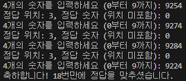

# 다빈치 코드 게임
- 파이썬 스터디 final project

## Project 소개
- 0부터 9까지의 난수로 이루어진 4자리의 비밀 코드를 맞추는 게임

## Project 주요 내용
- 사용자가 4자리의 숫자를 입력
- 비밀 코드 4자리 숫자와 비교 후 힌트 제공
- 힌트: 정답 위치 & 정답 숫자(위치 미포함)
- 시도를 할 때마다 횟수 저장 후 정답을 맞추면 몇 번만에 성공했는지 출력

